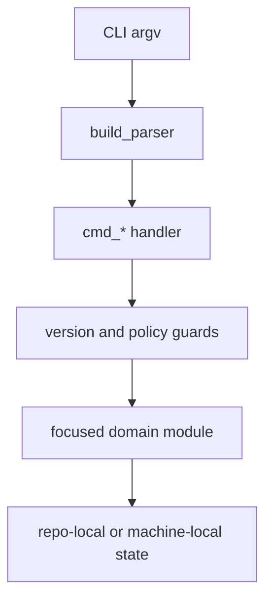

# CLI Composition and Command Surface

`horus.cli:main` is the installed public entry point (`pyproject.toml` maps `horus` to it; `python -m horus` delegates through `horus/__main__.py`). `build_parser()` owns the argparse surface and handlers orchestrate focused modules rather than reimplementing domain logic.

## Command families

| Intent | Commands | Owning modules |
|---|---|---|
| Project continuity | `init`, `doctor`, `resume`, `close`, `consolidate`, `infer`, `reconcile` | `initialize`, `continuity`, `routines`, `closure`, `instructions` |
| Backlog and planning | `backlog`, `brainstorm`, `capabilities`, `datum`, `fleet` | `backlog*`, `brainstorm`, `capabilities`, `datums` |
| Agent work | `open`, `run`, `sessions`, `attach`, `stop`, `tail`, `tui` | `launch`, `run_executor`, `registry`, `terminal_sessions` |
| Autonomous work | `envelope`, `schedule`, `supervise`, `notify`, `ask` | `envelope`, `schedule`, `supervise`, `notify`, `input_bridge` |
| Operator views | `dashboard`, `app`, `status`, `statusline`, `vscode` | `dashboard`, `companion`, `terminal_tui`, `vscode` |
| Fleet/remotes | `discover`, `refresh`, `start`, `onboard`, `forget`, `prune` | `github_catalog`, `remote_start`, `config` |
| Maintenance | `upgrade-project`, `reinstall`, `self-update`, `verify-inventory`, `proxy` | `upgrade`, `reinstall`, `selfupdate`, `verify_inventory`, `proxy` |

The full parser registration is the authoritative command list in `horus/cli.py:build_parser`. Scheduler forwarding receives that live list after registration, avoiding a second stale allow-list.

## Guard ordering

Mutating handlers enforce the recorded project version floor before effects. `cmd_run` resolves account/model and validates an optional envelope before creating a worktree or spending a usage preflight. That ordering is a safety contract, not UI polish.

This shows the intended handler boundary: parsing and cross-domain orchestration precede domain-owned effects.

## Change guidance

Add a command by registering it in `build_parser`, keeping validation in the handler, and putting durable semantics in its subsystem. If a scheduled form is valid, ensure it remains derived from the parser command surface. Add parser/exit behavior to `tests/test_cli.py` and focused behavior to the subsystem suite.

**Focused validation:** `pytest -q tests/test_cli.py`.

See [continuity and lifecycle](../continuity/project-lifecycle.md), [execution](../execution/agents-and-runs.md), and [unattended dispatch](../automation/unattended-dispatch.md).
