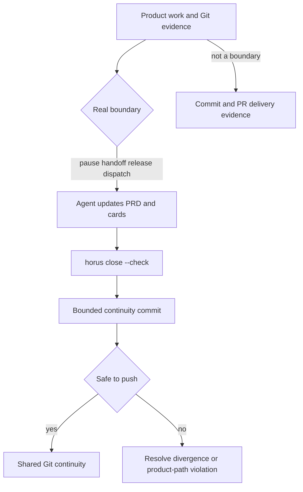

# Repo-Local Continuity and Evolution

## Authority and format precedence

The current format is **v3**: `.horus/PRD.md` is canonical narrative continuity and `.horus/backlog/` holds one active card per file. `frontmatter.has_prd()` detects v3. `frontmatter.resolve_focus()` first takes a non-empty PRD frontmatter value, then falls back **per missing field** in this exact legacy order: `status` → `project.md`; `current_focus` → `project.md`, then `roadmap.md`; `next_action`, `next_prompt`, and `execution_recommendation` → `roadmap.md`. (It uses `project.md`, then `roadmap.md`, for `last_updated`.) `continuity.check_project()` accepts the older committed lane format when no PRD exists (`project.md`, `roadmap.md`, `decisions.md`, with `features.md`/`history.md` recommended), but new initialization scaffolds v3.

| Material | Status | Rule |
|---|---|---|
| `.horus/PRD.md` | Canonical in v3 | Vision, current focus/next action, durable rules, and handoff prose. |
| `.horus/backlog/*.md` | Canonical working queue | Open cards and planning metadata; see [card workflow](../backlog/cards.md). |
| `.horus/backlog/archive/*.md` | Canonical closed record | Delivered cards carry `status: shipped`, PR, and SHA; archive also contains non-delivery terminal decisions. |
| `.horus/archive/` | Historical only | Retired lanes retained for archaeology, not current product structure or active resolution. |
| `.horus/sessions/*.md` | Optional local recovery | Gitignored by init; can preserve local recovery context but never substitutes for committed PRD/card/Git state. |
| `.horus/temp/` | Fleeting local material | Worker handoffs/evidence; accepted results must be distilled into durable material. |

The repository’s live `.horus/README.md` and source both make this distinction: archive lanes are not the supported current model, and a missing recovery note is healthy rather than a failure.

## Boundary model

*Canonical prose batches at real boundaries; Git/PR delivery safety applies continuously.*

`closure.py` is intentionally the verify-first half. The in-context agent writes the meaningful summary; `closure_status()` composes continuity health, field freshness, pending delivery commits, instruction drift, usage signals, dirty continuity, and the Git checkpoint gate. `pending_delivery_commits()` compares product commits after the latest canonical continuity commit, making Git history—not a local marker—the durable receipt.

`horus close --check` is a gate-oriented check: `freshness_gate()` combines `routines.freshness_signals()` with `backlog.hygiene_findings()`. `close_check_healthy()` keeps malformed readiness/autonomy warnings visible but advisory; other warning/failure hygiene and freshness findings make the check non-zero. Normal `horus close --commit [--push]` stages only continuity pathspecs, fetches before a push, refuses newer upstream continuity, and refuses a direct default-branch push carrying non-continuity product paths. It does not silently push product work around required checks.

## Migration and projected artifacts

`initialize.init_project()` is additive: it preserves an existing `PRD.md`, preserves existing cards, creates a blank tracked backlog rather than fabricated work, and adds `.horus/.gitignore` rules for local sessions/temp state. Existing `AGENTS.md` or `CLAUDE.md` receive a managed block only with confirmation (or `--yes`).

The older inline-backlog migration is explicit through `horus backlog migrate`; it is dry-run by default and tested for idempotent application. `horus init` does not rewrite an existing project into a new structure. Separately, `config.register_project()` adds a project to this machine’s fleet configuration; `continuity.registration_findings()` warns when valid repo-local continuity is absent from that local registry, because it will not appear in fleet/TUI views.

Instructions, bundled skills, and native hook projections are a separate compatibility surface:

- `instructions.check_drift()` compares managed blocks after normalizing their intentional cross-reference difference.
- `skills.install_skills()` installs the versioned Claude/Codex projections.
- `upgrade-project --apply` refreshes managed blocks, skills, and hooks but does **not** author continuity prose.
- `projection_sync.sync_state` is rendered by dashboard/TUI so installed CLI/project projections can be reported independently.

In the Horus repository itself, `closure.PROJECTED_ARTIFACT_PATHS` treats `.claude/skills`, `.agents/skills`, `.claude/settings.json`, and `.codex/hooks.json` as committed projections. Because `horus/skills.py` generates them here, closure blocks a direct default-branch push of projections that would be separated from their generator source.

## Validation and extension points

| Change | Owning code | Narrow validation |
|---|---|---|
| Focus precedence or format compatibility | `frontmatter.py`, `continuity.py` | `pytest -q tests/test_frontmatter.py tests/test_init.py` |
| Closure or checkpoint behavior | `closure.py`, `routines.py` | `pytest -q tests/test_closure.py` |
| Backlog migration | `backlog_migrate.py`, CLI handler | `pytest -q tests/test_backlog_migrate.py tests/test_cli.py -k migrate` |
| Managed block reconciliation | `instructions.py`, `templates.py` | `pytest -q tests/test_instructions.py tests/test_reconcile.py` |
| Skills/hooks/projection refresh | `skills.py`, `native_hooks.py`, `upgrade.py` | `pytest -q tests/test_skills.py tests/test_upgrade.py tests/test_projection_sync.py` |

Do not use `.horus/archive/` as implementation guidance for new behavior, and do not make sessions mandatory merely because local recovery notes exist.
