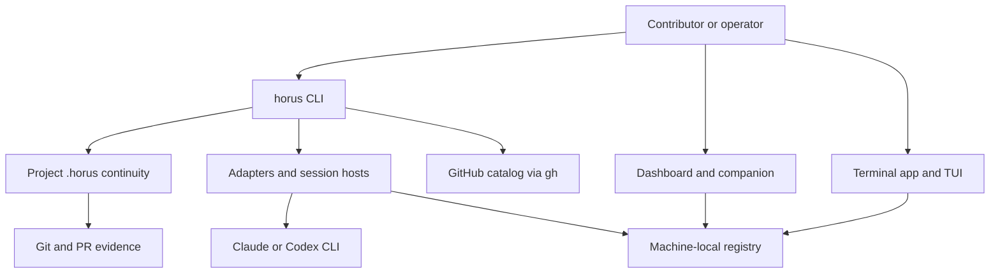

# Horus Architecture Overview

Horus is a Python CLI application that preserves project handoff state for official Claude and Codex CLIs; it does **not** implement a model loop or own model API keys. Its durable project contract is committed, repository-local `.horus/` material, while process/account state lives on the machine that launches agents. `pyproject.toml` exposes `horus.cli:main`; `python -m horus` reaches the same entrypoint through `horus/__main__.py`.

## System boundary

*This shows the local control surfaces, repo-local continuity, and machine-local execution state.*

| Boundary | Owner | What belongs there |
|---|---|---|
| Project-local, committed | `.horus/PRD.md`, `.horus/backlog/`, managed instruction/projection files | Shared orientation, open work cards, shipped provenance, workflow policy. See [continuity](continuity.md) and [cards](../backlog/cards.md). |
| Project-local, ignored | `.horus/sessions/`, `.horus/temp/`, `.horus/.consolidated-to` | Optional recovery notes and transient handoffs/checkpoint bookkeeping; not cross-machine canonical state. |
| Machine-local | `~/.horus/` configuration, registry, accounts, envelopes, GitHub cache | Accounts, PIDs, session targets, dispatch authorization, and local catalog cache. See [accounts and launch](../sessions/accounts-and-launch.md). |
| External tools | Native agent CLIs, Git, optional `gh`, tmux/herdr, systemd user services | Execution and integrations; absence causes explicit degradation/refusal in relevant surfaces. |

## Composition and public surfaces

`horus/cli.py` owns parser construction and command dispatch. Domain modules own continuity, card handling, launching, registry, dashboard, and operations; tests generally exercise both the pure domain module and `main([...])` wiring. The [CLI command map](../cli/commands.md) is the canonical navigation point for commands.

- **CLI:** lifecycle, backlog, launch, account, schedule, supervision, catalog, and contributor operations.
- **Dashboard:** a local `ThreadingHTTPServer` read model with POST launch/control paths, browser PTY support, and an opt-in exposed mode. See [dashboard](../surfaces/dashboard.md).
- **Companion:** Tk desktop presence layer that owns only the dashboard/browser children it starts; it is not the dashboard server.
- **Terminal UI:** prompt-toolkit cockpit with a line-oriented fallback; it delegates session behavior to `terminal_sessions`. See [TUI](../surfaces/tui.md).
- **Native adapters and hosts:** adapters construct agent-specific argv/environment; hosts decide persistence, attachability, viewers, and liveness. See [accounts and launch](../sessions/accounts-and-launch.md) and [hosts and registry](../sessions/hosts-and-registry.md).

## Design constraints

1. **Native tools remain native.** `adapters` normalizes launch and events; Horus does not replace Claude/Codex authentication or execution semantics.
2. **Repo-local prose is not PID state.** The registry is deliberately machine-local because PIDs and terminal targets cannot travel safely in Git.
3. **Read models do not become authorities.** Dashboard/TUI render PRD-first focus and card data; they do not replace the underlying files.
4. **No silent fallbacks across security boundaries.** Unknown accounts, unsupported backend targets, invalid exposure configuration, and unsafe unattended authorization are rejected rather than guessed.
5. **Git/PR evidence and continuity have distinct cadences.** Delivery is protected by branches, commits, pushed refs, PRs, and deterministic gates; canonical prose is consolidated at real handoff boundaries.

## Where to change what

| Intent | Start with | Focused tests |
|---|---|---|
| Add or alter a CLI command | [CLI command map](../cli/commands.md) | `tests/test_cli.py` plus the domain suite |
| Change continuity/card policy | [Continuity](continuity.md), [cards](../backlog/cards.md) | `test_closure.py`, `test_backlog.py`, `test_init.py` |
| Change a launch/account/session behavior | [Accounts and launch](../sessions/accounts-and-launch.md) | `test_launch.py`, adapter tests, `test_account_*` |
| Change persistence/attach/recovery | [Hosts and registry](../sessions/hosts-and-registry.md) | `test_registry.py`, `test_terminal_sessions.py` |
| Change browser/UI behavior | [Dashboard](../surfaces/dashboard.md) or [TUI](../surfaces/tui.md) | `test_dashboard.py`, `test_terminal_tui.py` |
| Change unattended delivery | [Dispatch and delivery](../operations/dispatch-and-delivery.md) | `test_envelope.py`, `test_supervise.py`, `test_worktree.py` |
