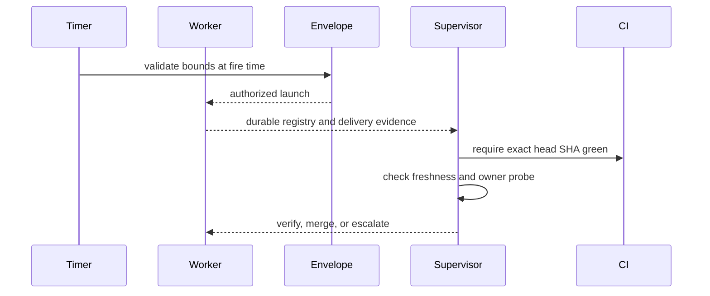

# Unattended Dispatch, Scheduling, and Supervision

Autonomy is deliberately decomposed: an envelope authorizes bounded launches, a systemd timer invokes Horus, a worker executes, and `supervise` independently accepts or escalates. No worker report is acceptance evidence.

## Envelope authorization

`Envelope` is machine-local at `~/.horus/envelopes/<name>.toml`; its append-only `<name>.jsonl` ledger derives attempts and daily usage. It bounds exact cards or a branch, canonical agent-account labels, neutral capability tiers, optional effort, usage floor, expiry, attempt/day limits, and optional merge authority. Creation rejects unsafe names, duplicates, past expiry, empty selectors/accounts/tiers, unresolved or ambiguous accounts, unknown tiers, and invalid numeric limits. Account spellings canonicalize to `<agent>-<alias>`; model tiers normalize to neutral labels.

`cmd_run` resolves its account and invokes `_envelope_guard` before unattended defaults, Git/worktree creation, or normal usage preflight. Guarded tier/branch come from card frontmatter, not caller assertions. Validation checks revocation, inclusive expiry, card/branch, account, tier, effort, ledger-derived UTC per-day/per-card limits, and optionally fail-closed usage. An authorized dispatch is appended before execution, so even a bounced launch spends its allowed attempt. Malformed TOML is no authorization; torn ledger rows are skipped.

An envelope never selects card, account, model, or routing. Bounds are read at fire time, so revocation stops pending launches but not running sessions. Malformed or unknown capacity data fail closed for unattended use.

## Schedule and worker preparation

`schedule` writes one-shot systemd user units under `~/.config/systemd/user`, with persistent timer behavior; it is capability-gated to Linux/systemd. Scheduled invocation uses `sys.executable -m horus`.

`cmd_run --unattended` validates its envelope before worktree or usage effects and supplies protected defaults: worker mode, persistent detached host, and card worktree. The common executor then records execution evidence.

## Independent supervision

`supervise` resolves its context from registry and envelope ledger: pinned dispatch base, expected delivery, card, and merge authority. A merge requires all relevant evidence: authorization, exact-SHA CI, freshness, and an owner-authored machine-local probe. A PR reference without a session stays verify-only.

On failure, escalation is best effort but verdict is deterministic. Andon halts only scheduled cards transitively dependent on the failed card; independent work stays armed. `schedule release` explicitly re-arms halted work.

Notifications and `notify listen` are bounded owner-control channels, not shell or LLM execution authority. `ask` uses the input bridge for a constrained owner response.

**Focused tests:** `tests/test_envelope.py`, `tests/test_schedule.py`, `tests/test_supervise.py`, `tests/test_notify.py`, `tests/test_notify_listen.py`, `tests/test_batch.py`.

For worktree and Git evidence ownership, see [Git delivery and integration](../delivery/git-integration.md).
