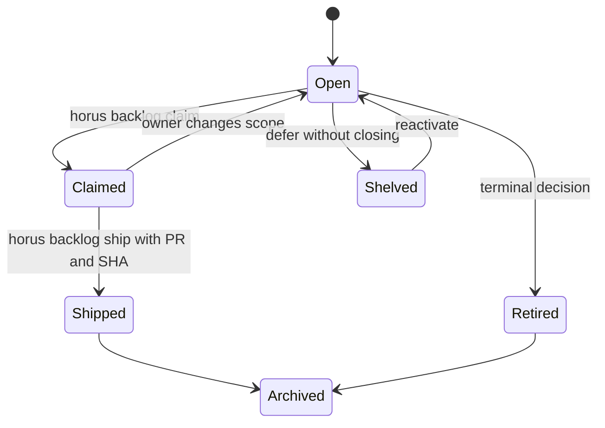

# Card-Backed Backlog Workflow

`horus/backlog.py` owns the active file-per-card model. `load_cards()` reads only Markdown files directly below `.horus/backlog/`; it deliberately excludes `.horus/backlog/archive/`. The PRD points to cards rather than duplicating card counts or status in prose.

## Card states and locations

*Active working cards stay in the backlog root; shipped and other terminal cards reside in the archive.*

A card is Markdown with front matter and an `#` title. Key fields include `status`, `priority`, `tier`, `created`, `type`, `parallel`, `surface`, `readiness`, `autonomy`, `readiness_reason`, `order`, and optional shipped provenance. `type` defaults to `task`; `phase` defaults to `converge`.

| State/field | Meaning and invariant |
|---|---|
| `open`, `claimed` | Active lifecycle states. Claiming changes only `status` after a guarded check. |
| `shelved` | Not closed and not displayed as working queue. It preserves unresolved text intentionally. A `bug` cannot be shelved: hygiene emits `fail`. |
| `shipped` | `horus backlog ship <card> --pr … --sha …` stamps provenance then moves the full file to archive, refusing overwrite. |
| `retired`, `folded-in`, `done` | Closed decisions may be archived but are not deliveries. Archive is not synonymous with shipped ledger. |
| `parallel: exclusive` / `surface` | Human-authored concurrency guardrails, not a scheduler. Surfaces are comma-separated globs. |
| `## Reviews` | Append-only free text. Tooling never parses its body as lifecycle data. |

## Readiness is separate from lifecycle

`readiness_queue()` has six displayed queues: Ready—Autonomous eligible, Ready—Attended, Shaping, Gated, Deferred, and Unclassified. A Ready card needs `autonomy: eligible|attended`; non-Ready cards need `readiness_reason`. Invalid/missing combinations stay **Unclassified**, never guessed into an autonomous queue. Only Ready—Eligible passes `is_autonomous_candidate()`.

`order` is a sparse, owner-approved integer sequence **within** a readiness queue. `readiness_sort_key()` places ordered cards before unordered cards, then priority and name. Duplicate/non-integer order is warned about rather than repaired. This preserves planning data without turning the backlog into an auto-routing system.

## Claims, dependencies, and hygiene

`claim()` holds `.horus/backlog/.claim.lock` for load/check/write on Unix to avoid a concurrent-claim TOCTOU window. Windows degrades to advisory locking rather than making Horus unimportable. Warnings for exclusive cards, absent surface metadata, or overlapping glob surfaces block a claim unless `--force`; a nonexistent card is always a failure.

`hygiene_findings()` reports lifecycle drift: lingering done language outside reviews, shipped provenance on a non-shipped card, malformed readiness/order, and unreachable dependencies. A card gated on a shelved or retired active-root blocker is warned because that gate cannot lift; a shipped/done/folded-in blocker satisfies it.

## Change recipe

1. Create/edit the card in `.horus/backlog/`; do not create a parallel folder for bugs.
2. Give a card real scope and, when parallel work matters, `parallel` and `surface` metadata.
3. Use `horus backlog claim <name>` before parallel execution; only use `--force` as an explicit override of warnings.
4. Refine readiness/order through the backed workflow rather than inventing autonomous eligibility.
5. On an actually merged delivery, ship with exact PR/SHA provenance. On a non-delivery terminal decision, retain truthful status and archive appropriately.
6. At a real continuity boundary, update the PRD handoff and run `horus close --check`; card readiness warnings remain visible but are not a PR delivery freshness gate.

| Task | Code/tests | Minimal check |
|---|---|---|
| Schema/lifecycle change | `horus/backlog.py`, `horus/backlog_tree.py` | `pytest -q tests/test_backlog.py tests/test_backlog_tree.py` |
| Migration/refinement change | `backlog_migrate.py`, `backlog_refine.py` | `pytest -q tests/test_backlog_migrate.py tests/test_backlog_refine.py` |
| CLI/TUI rendering change | CLI backlog handlers, `terminal_tui.py` | relevant test plus `tests/test_terminal_tui.py -k backlog` |
