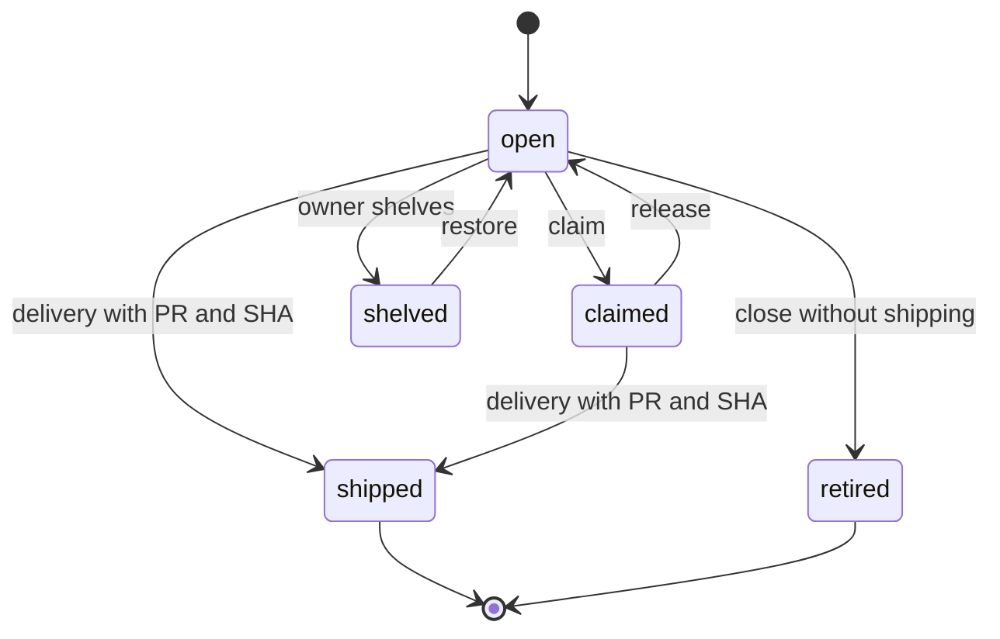

# Card-Backed Backlog and Portfolio Views

`horus.backlog` makes `.horus/backlog/*.md` the active portfolio. Cards carry lifecycle and planning metadata; they are not an autonomous scheduler. `load_cards()` intentionally excludes the archive.

## Card semantics

Cards parse `status`, `priority`, `tier`, `type`, `parallel`, `surface`, `vision_facet`, `phase`, `readiness`, `readiness_reason`, `autonomy`, `order`, `shipped_pr`, and `shipped_sha`.

| State | Meaning |
|---|---|
| `open` / `claimed` | Active work in the root backlog |
| `shelved` | Still active on disk but omitted from working queues |
| `shipped` | Delivered and archived with provenance |
| `retired`, `folded-in`, `done` | Closed without necessarily shipping, archived |

Archive means closed, not delivered: only `status: shipped` is a delivery assertion; PR/SHA metadata alone does not change that. Consumer views therefore load root active cards, root shelved cards, and archived cards separately, then partition the archive into shipped and closed-without-shipping. A bug card may not be shelved because hiding an evidenced defect is unsafe.

## Readiness, ordering, and claims

Readiness and lifecycle are separate. Canonical views assign cards to Ready—autonomous eligible, Ready—attended, Shaping, Gated, Deferred, or Unclassified. Only a decision-complete `ready` card with eligible `autonomy` is an autonomous candidate; missing or malformed metadata is Unclassified, never inferred as safe. `order` is a sparse, owner-approved planning key **within** one readiness queue, not execution authority across queues. Duplicate order is ambiguous only within a queue and produces hygiene findings; malformed values are not coerced. If no cards have `order`, legacy backlogs retain priority/name behavior.

`parallel: exclusive` and glob-like `surface` fields are claim-time collision hints. Normal claims block unverifiable or overlapping work unless explicitly forced. They do not prove implementation scope and do not schedule work.

This is the card lifecycle; scheduling eligibility is a separate readiness/autonomy projection.

## Dependencies and views

Dependency hygiene reports dangling or unreachable dependencies; shipped dependencies are satisfied. `backlog_tree` groups branch cards beneath an umbrella, otherwise by `vision_facet`, retaining unresolved and unsorted work visibly. `backlog_refine` produces context for an owner-attended decision process; it deliberately does not duplicate or automate that process.

The advisory planning layer—including datum and fleet intelligence—is documented in [planning and fleet intelligence](../planning/fleet-intelligence.md). Cards feed [unattended dispatch](../automation/unattended-dispatch.md) only after explicit envelope authorization.

**Focused tests:** `tests/test_backlog.py`, `tests/test_backlog_tree.py`, `tests/test_backlog_migrate.py`, `tests/test_backlog_refine.py`.
