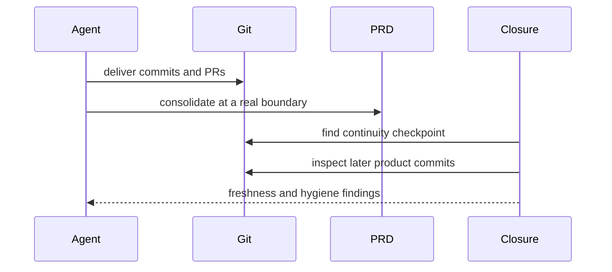

# Repo-Local Continuity and Closure

Horus keeps project truth in committed `.horus/` files so a fresh agent on another machine can orient from Git. The current shape is v3: `.horus/PRD.md` plus card files in `.horus/backlog/`. `frontmatter.resolve_focus()` reads PRD fields first while supporting legacy lanes during migration.

## Durable versus local state

| Location | Owner and purpose | Tracking |
|---|---|---|
| `.horus/PRD.md` | Vision, rules, shipped ledger, and handoff frontmatter | committed |
| `.horus/backlog/*.md` | Active card-per-file portfolio | committed |
| `.horus/backlog/archive/` | Closed ledger | committed |
| `.horus/sessions/` | Optional recovery notes | ignored except `.gitkeep` |
| `.horus/temp/` | Temporary worker handoffs | ignored except `.gitkeep` |

`continuity.check_project()` recognizes v3 when `PRD.md` exists. Otherwise it checks legacy required `project.md`, `roadmap.md`, and `decisions.md`, with `features.md` and `history.md` recommended. `horus init` does not convert an existing structure implicitly.

## Resume is orientation, not permission

The PRD frontmatter fields `current_focus`, `next_action`, `next_prompt`, and `execution_recommendation` drive `routines.resume_context()` and `resume_prompt()`. The prompt instructs a session to fetch and verify branch state, then load only the smallest useful context. It cannot grant execution consent; native agent permission posture is the authorization mechanism.

## Closure and freshness

`closure` is deterministic verification and optional commit/push support, not a summarizer. Its checkpoint is the most recent continuity commit; `pending_delivery_commits()` finds later product commits while excluding continuity/projection paths. This makes freshness portable across clones and squash merges.

This flow separates durable delivery receipts in Git from the orientation update in PRD prose.

Important boundaries:

- A clean pushed feature branch is not automatically canonical default-branch continuity; closure reports that distinction as advisory context.
- Readiness warnings are not closure-gate failures: readiness controls scheduling, not whether delivery is durable.
- Recovery notes are optional and must not become required closure output.

**Focused tests:** `tests/test_frontmatter.py`, `tests/test_routines.py`, `tests/test_closure.py`, `tests/test_init.py`.

Related: [backlog model](backlog.md), [project lifecycle](project-lifecycle.md), and [Git delivery](../delivery/git-integration.md).
