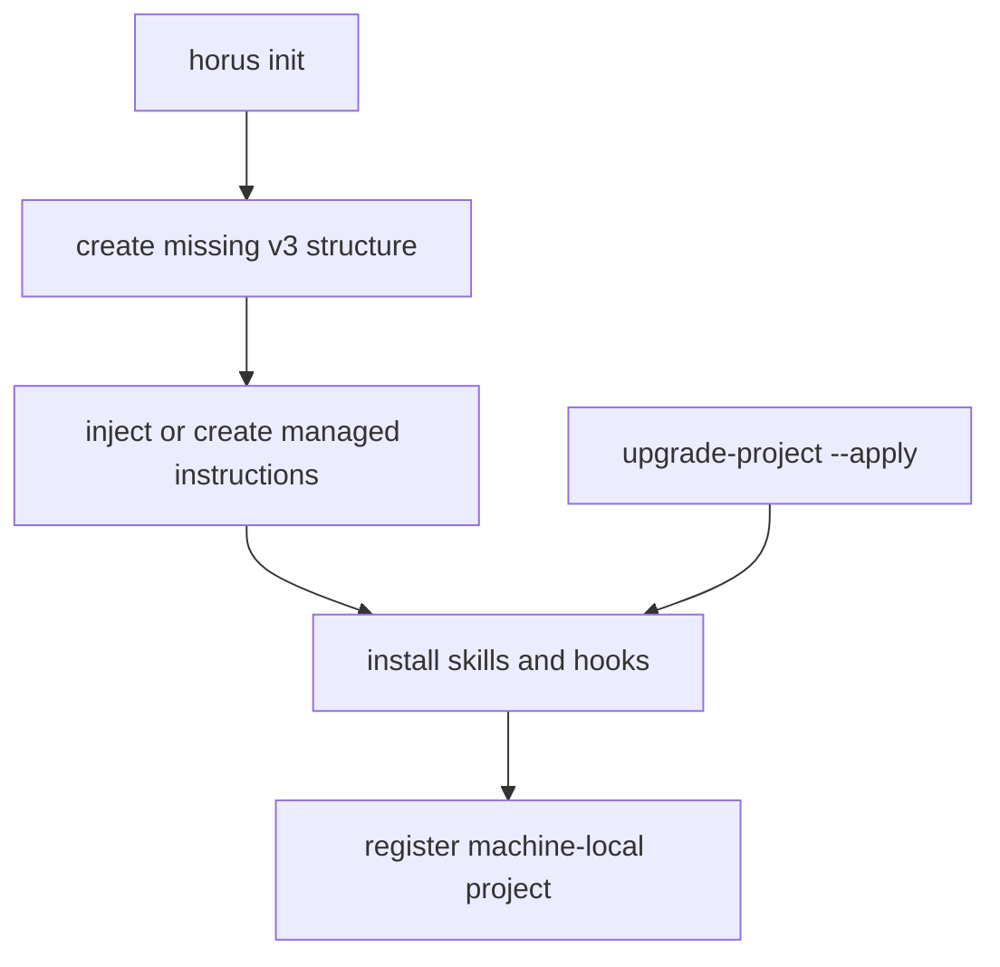

# Project Initialization and Generated Projections

`initialize.init_project()` creates missing Horus artifacts without clobbering project-owned content. It creates v3 PRD/backlog/session/temp structure, local ignore rules, optional skills/hooks, and registers the project in machine-local configuration.

## No-clobber scaffold

Existing `PRD.md` stays intact. Existing instruction files receive the managed block only after confirmation (or explicit noninteractive approval); all content outside it is preserved. A blank backlog gets `.gitkeep`, not invented work. `.horus/.gitignore` keeps recovery notes, temporary handoffs, and claim locks local.

## Managed instruction and projection contract

`templates.shared_block()` is centrally versioned and rendered into `AGENTS.md` and `CLAUDE.md`, with only their reciprocal reference differing. `instructions.extract_block`, drift checks, and reconciliation normalize that deliberate difference and avoid touching unmanaged text.

Projected skills and native hooks are consumer-facing artifacts. `upgrade_project()` refreshes:

1. ignore rules;
2. managed instructions;
3. the PRD `horus_min_version` stamp;
4. versioned skills and hook projections.

It supports dry run, preserves unversioned copies it cannot safely own, and refuses to replace a newer managed block with an older installed version. The version floor stops state-mutating commands before incompatible effects.

This shows init creates only absent structure, while upgrade refreshes owned projections conservatively.

Native hooks are advisory surfaces and are shell-guarded to exit successfully when Horus is unavailable, preserving collaborator usability. See [configuration and projections](../operations/config-and-projections.md) for account/usage hook behavior.

**Focused tests:** `tests/test_init.py`, `tests/test_instructions.py`, `tests/test_upgrade.py`, `tests/test_skills.py`, `tests/test_native_hooks.py`.
