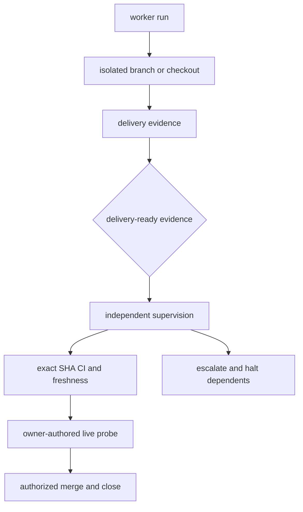

# Git Delivery, Worktrees, and Integration

This page owns the path from a dispatched run to durable Git delivery. The system distinguishes best-effort evidence from merge-blocking evidence and keeps acceptance in supervision rather than the worker.

## Worktrees and repository state

`worktree` creates or reuses sibling worktrees for isolated worker branches. It resolves the primary checkout for data that must survive a removed worktree and classifies cleanup/reclaim conservatively; cleanup remains an owner action rather than an implicit deletion policy.

`gitstate` provides local branch/freshness facts. `fetchcheck` performs remote-fetch checks without changing working files. `delivery.capture_delivery_evidence()` inspects branch, head/pushed SHA, PR, local changes, and continuity state best-effort; inability to inspect must not break worker completion.

## Integration policies

`integration.integrate()` packages Git/GitHub effects in an `IntegrationResult` across four machine-configured modes:

| Mode | Result |
|---|---|
| `local-only` | stage and commit |
| `direct-push` | commit and push `HEAD` |
| `branch-pr-review` | branch, push, open PR |
| `branch-pr-automerge` | PR plus requested auto-merge behavior |

Onboarding passes explicit managed paths; ordinary integration may stage all changes. Branch-mode failure handling attempts to restore the base checkout after post-push failure and returns structured status instead of obscuring partial effects.

## Evidence grades and acceptance

`delivery-ready` is review evidence only. `mergewatch` requires checks on the exact head SHA; `closure.pr_freshness_gate` evaluates continuity/diff freshness. Only [supervision](../automation/unattended-dispatch.md) can merge, and only under envelope merge authority plus pinned delivery context and probe. After merge, it closes continuity and stamps/archives the card with PR/SHA provenance.

A dead PID, a pushed commit, an optimistic worker message, or an unavailable probe is never silently upgraded to acceptance. Conversely, best-effort delivery/remote inspection does not make the executor crash.

**Focused tests:** `tests/test_worktree.py`, `tests/test_delivery.py`, `tests/test_gitstate.py`, `tests/test_fetchcheck.py`, `tests/test_mergewatch.py`, `tests/test_integration.py`, `tests/test_workflow_policy.py`, `tests/test_supervise.py`.

Execution ownership is in [agents and runs](../execution/agents-and-runs.md); continuity checkpoint semantics are in [continuity and closure](../continuity/model.md).
