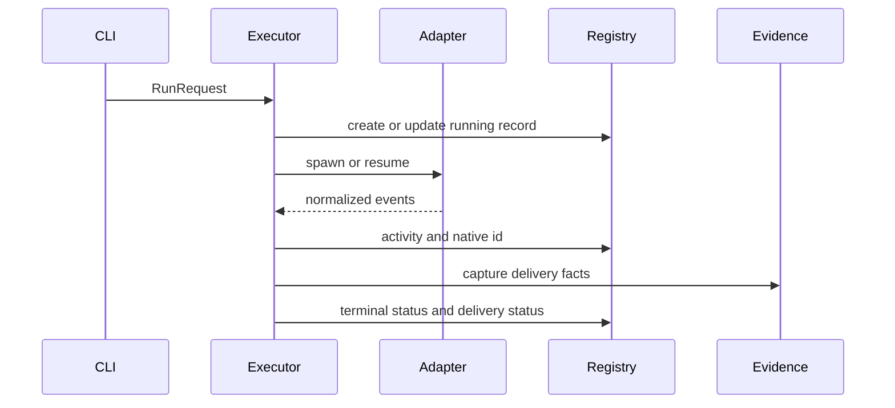

# Agent Adapters, Runs, and Session Evidence

Adapters normalize native CLIs behind `AgentAdapter`. Each adapter supplies permission flags, argv construction, environment construction, and stream parsing; shared code spawns processes and maintains `AgentRun`/`AgentSession`.

## Contract and identity

`SpawnSpec` carries project, prompt, account, posture, model, effort, worker, and proxy settings. Normalized events include session start, text, tools, permission requests, result, and error. A terminal `RESULT` is authoritative: a mid-run tool error does not fail an otherwise completed run.

Horus’s durable `session_id` is distinct from the native agent thread ID. Claude can preassign a thread ID; Codex mints one later. Do not substitute either value for the other when implementing resume or display.

## Attended and worker paths

`launch.prepare_interactive()` is shared by CLI, dashboard, and UI. It validates adapter/posture, runs account identity protection for mapped non-proxied accounts, builds argv/env, and records native identity where known. A host then displays it and `Registry` records a running row.

`cmd_run` constructs a serializable `RunRequest`; both foreground and detached runners call `run_executor.execute()`.

This shared path keeps parsing, logs, datum capture, registry updates, and delivery classification equivalent for foreground and hosted runs.

## Operational evidence

Machine-local `Registry` persists `~/.horus/registry.json`; `runlog` writes human log and JSONL event sidecars. Known-field updates preserve unknown future fields and normalize timestamps to aware UTC. Mutating reconciliation prefers a terminal JSONL result, falls back to legacy logs, then marks a dead process stale; read-only snapshotting projects state without rewriting it. PID-only staleness captures delivery facts but never invents datum completion, while a persistent host is called `vanished` only when it should have recorded a normal exit. `delivery.capture_delivery_evidence()` is best effort and `delivery-ready` means review evidence, not acceptance.

For a resume, `Registry.resolve_resume_id()` first resolves the exact Horus row key, then recorded native IDs. Equal legacy IDs work; absent native IDs are not guessed; unknown IDs remain pass-through for a native session Horus never recorded. `cmd_run` translates before it serializes `RunRequest`, so foreground and detached runs agree, and a failed resume prints the native ID actually attempted.

`datums` records mechanical launch/completion facts; qualitative outcome and owner priors are separate. See [planning and fleet intelligence](../planning/fleet-intelligence.md). Git/worktree details are canonical in [Git delivery and integration](../delivery/git-integration.md).

**Focused tests:** `tests/test_adapters.py`, `tests/test_claude_adapter.py`, `tests/test_codex_adapter.py`, `tests/test_launch.py`, `tests/test_registry.py`, `tests/test_runlog.py`, `tests/test_delivery.py`, `tests/test_terminal_sessions.py`. In particular, `test_detached_executor_keeps_runner_pid_through_concurrent_completion_reconcile` protects the completion race: a reconcile must not replace a detached runner’s durable terminal receipt with stale/blocked after its adapter child exits.
