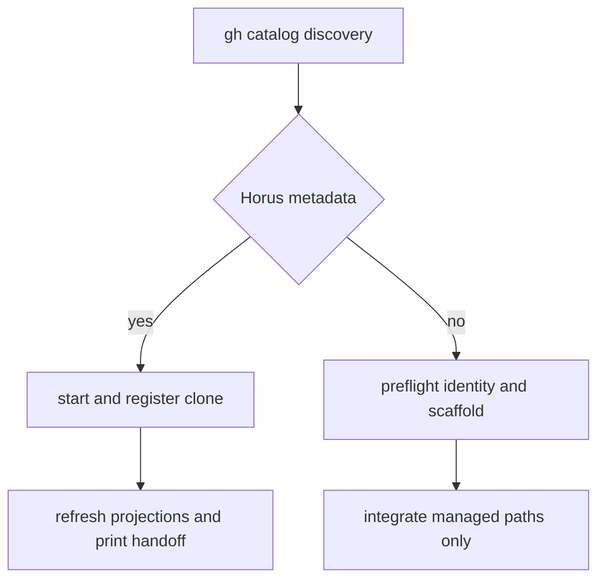

# GitHub Catalog, Remote Start, and Onboarding

`github_catalog` treats GitHub as a remote catalog of durable `.horus/` state, not a session store. It stores machine-local owner snapshots under `~/.horus/github-cache/` and uses `gh` to discover repositories.

## Discovery and cache

For each repository, discovery uses metadata and `pushedAt`; unchanged entries reuse cached classification. Changed entries read `.horus/PRD.md`, with compatibility fallbacks to legacy project/roadmap files. PRD fields win per field. Repositories with no continuity metadata are untracked, not Horus projects.

Local matching normalizes SSH/HTTPS GitHub remotes and `.git` suffixes, checking both registered projects and the configured workspace root. Dashboard rendering removes already registered matches to avoid duplicate remote cards.

## Start versus onboard

| Command | Preconditions | Effects |
|---|---|---|
| `horus start github:<owner>/<repo>` | Catalog says the repo is Horus-enabled | Reuse/make clone, verify `.horus/`, register, apply projections, print resume context |
| `horus onboard github:<owner>/<repo>` | Catalog says repo is untracked and Git author identity exists | Clone/reuse safely, scaffold, stage only managed artifacts, integrate by policy |

Onboarding rejects already-Horus repositories, refuses a non-git destination, and only copies invoking Git identity into target-local config when needed. `_HORUS_MANAGED_PATHS` prevents unrelated worktree files from entering the onboarding commit. A failed integration becomes a reported warning after successful scaffold/commit rather than a rollback of completed work.

This decision is metadata-driven and does not overwrite a repository merely because its name matches.

Integration workflow modes and delivery verification are canonical in [Git delivery and integration](../delivery/git-integration.md); local configuration is in [configuration and projections](../operations/config-and-projections.md).

**Focused tests:** `tests/test_github_catalog.py`, `tests/test_remote_start.py`, `tests/test_onboard.py`, `tests/test_integration.py`.
