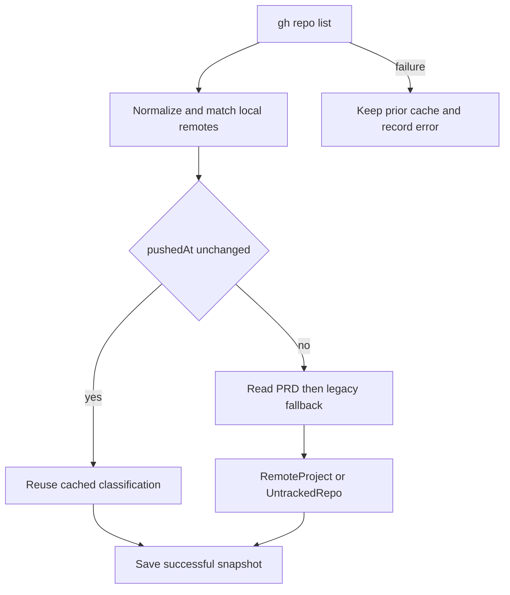

# GitHub Catalog, Local Start, and Onboarding

GitHub is a catalog for durable Horus project material, not a remote session host. `github_catalog.py` uses the authenticated `gh` CLI; `remote_start.py` clones/reuses repositories **on the local machine**, registers them, and refreshes local projections. Session execution still uses `LocalBackend` and local hosts.

## Discovery and cache

`discover()` lists an owner’s repositories with `gh repo list`, normalizes remote URLs, matches local clones by actual remote equivalence, and separates:

- `RemoteProject`: a repository with `.horus/PRD.md` (PRD-first fields), with legacy project/roadmap per-field fallback;
- `UntrackedRepo`: a repository missing both continuity roots.

`pushedAt` is an incremental cache key. Unchanged records reuse cached classification/focus fields; changed/new repositories take the content-fetch path. Successful `refresh_cache()` replaces the local snapshot; a failed refresh uses `record_cache_error()` while retaining the last successful entries. Registered local clones are filtered to prevent a duplicate local-project/catalog view; ignored filtering is case-insensitive.



*The catalog remains readable after a failed refresh without claiming fresh remote data.*

## Local registration, start, and onboarding

`config.register_project()` is machine-local fleet membership, not initialization: a valid project not registered locally is named by `continuity.registration_findings()` as absent from fleet/TUI views. Dashboard `/local-add` first validates an existing local path: an existing Horus project can be registered directly; a path without `.horus/` requires the user’s explicit initialization choice; invalid paths are rejected. These write paths use PRG redirects and are refused by the dashboard stale-build guard.

`parse_github_target()` accepts only `github:<owner>/<repo>`. `start_github_project()` requires discovery as `RemoteProject`, reuses/makes a workspace clone, requires `.horus/`, registers it through config, then applies `upgrade_project(..., apply=True)`.

`onboard_github_project()` is the complementary path for an `UntrackedRepo`:

1. Refuse a repository already Horus-enabled; direct it to start.
2. Preflight a complete Git identity before mutation.
3. Clone/reuse locally and refuse an existing `.horus/` directory.
4. If the target lacks identity but the invoking repository has it, write only target-repository `user.name`/`user.email`; never mutate global Git config.
5. Register, run noninteractive `initialize.init_project`, then stage only `_HORUS_MANAGED_PATHS` before `integration.integrate`.
6. Return integration failure honestly; do not pretend clone/init/commit were rolled back.

Dashboard routes additionally restrict GitHub owners to configured/trusted owners. Authentication remains `gh` ownership; Horus does not read/store a GitHub token.

```sh
pytest -q tests/test_github_catalog.py tests/test_remote_start.py
pytest -q tests/test_dashboard.py -k 'github_start or github_onboard'
```
