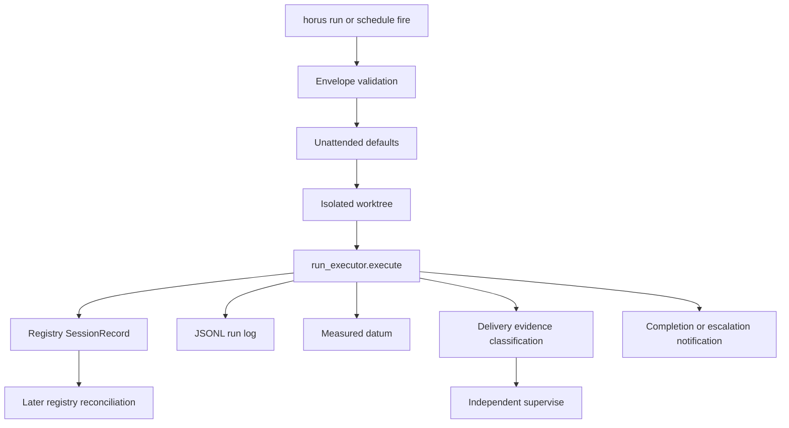

# Dispatch, Execution Evidence, and Delivery Supervision

This subsystem separates **authorization**, **worker execution evidence**, and **acceptance/supervision**. It does not treat an agent’s completion prose or a dead PID as a delivery receipt.

## Authorized launch and execution evidence

*Each stage records bounded local evidence; supervision resolves durable records rather than trusting a worker self-report.*

### Authorization

`cmd_run` first resolves adapter/model and the named account (unknown, ambiguous, or wrong-agent aliases refuse), then validates the envelope, applies unattended defaults, enforces the Codex delivery-posture rule, creates/reuses a requested worktree, and finally runs usage preflight before execution. Thus envelope authorization is earlier than worktree and usage effects; the posture refusal happens before either worktree or session creation. Unattended work requires `--envelope` and `--card`; envelope validation checks revocation, expiry, card/branch, canonical account membership, tier/effort constraints, attempts/day, and optional capacity floors. Unknown capacity fails closed where an envelope requires it. `--force` does not override owner envelope policy.

`_apply_unattended_defaults()` supplies worker identity, persistent target, detachment, and `auto/<card>` worktree when absent. Codex delivery-intent/worktree runs require `full-auto`; non-full-auto sandbox postures cannot reliably perform necessary Git/PR network actions. Before creating the `RunRequest`, the CLI captures the dispatch Git base SHA and any warning that product commits are pending the next continuity boundary, so the worker has a durable delivery basis rather than only its prompt.

`schedule run` persists systemd-user timer work on supported Linux environments. It validates the scheduled command at arm time, but `cmd_run` repeats authorization at **fire time**. Natural-language/past/nonpositive time expressions are rejected. Systemd unit files—not a duplicate registry—are schedule state.

### Evidence stores and partial failure

The normalized `run_executor.RunRequest` carries the selected agent/account/posture, project or worktree, native resume identity, dispatch basis, and detached/foreground execution intent into `run_executor.execute()`. Foreground work executes in the invoking path; detached work is restricted to a persistent-capable host and is registered for later attach/reconciliation. In either allowed path, `execute()` creates/updates a registry record, writes start/activity/result JSONL through `runlog`, records `datums.Datum` launch/completion measurements, classifies delivery through `delivery`, and may notify/escalate based on configured worker outcome. The registry holds the session projection; log sidecars preserve event evidence; datum records preserve mechanical measurement separately from agent-provided qualitative outcome; delivery records distinguish delivered/no-op/other evidence rather than fabricating success.

`Registry.reconcile()` is recovery logic, not a completion generator. It uses structured result events first, then legacy result text. A known result can update terminal status and delivery completion. A dead PID without such result becomes `stale`; `_apply_delivery_completion` deliberately does **not** infer datum completion or delivery from that fact alone. This prevents “process vanished” from becoming “worker delivered.”

## Independent supervision

`supervise` resolves worker context from registry, envelope ledger, Git/CI, and delivery records. Its safety rules are:

- exact-head CI must be green;
- continuity/freshness checks must pass as applicable;
- merge authority must come from the authorizing envelope;
- merge needs pinned delivery basis and an owner-authored local probe;
- otherwise verify-only or escalate; escalation halts only dependent scheduled work.

A selector is required: explicit target, `--card`, or `--branch`. This division makes supervise an independent acceptor, not a post-hoc wrapper around a worker’s claim.

## Validation matrix

| Concern | Focused tests |
|---|---|
| CLI ordering/guards | `tests/test_cli.py` |
| Envelope bounds/capacity/defaults | `tests/test_envelope.py` |
| Timer parse/unit behavior | `tests/test_schedule.py` |
| Executor/log/record lifecycle | `tests/test_runlog.py`, relevant `test_cli.py`/session tests |
| Datum and delivery classification | `tests/test_datums.py`, `tests/test_delivery.py` |
| Registry reconciliation | `tests/test_registry.py` |
| Supervision/merge/escalation | `tests/test_supervise.py` |
| Worktree isolation | `tests/test_worktree.py` |

Run `pytest -q` for cross-module changes: dispatch behavior spans CLI wiring, local state stores, Git, systemd seams, notifications, and supervision.
