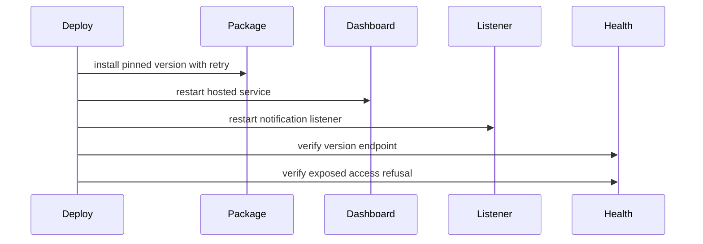

# Packaging, Release, and Hosted Deployment

`pyproject.toml` defines package metadata, Python `>=3.12`, the `horus = horus.cli:main` console entry point, Prompt Toolkit dependency, Windows-only `pywinpty`, and packaged visual/vendor assets. Release work must preserve both the CLI entry point and package-data boundary.

## Verification and maintenance

Repository workflows provide compile/pytest gates across supported Python versions plus publish/install smoke coverage. Runtime maintenance is split across:

- `versioning`: compatibility/version checks;
- `selfupdate`: discover/apply update behavior;
- `reinstall`: recovery-oriented reinstall behavior;
- `doctor_machine` and `machine_requirements`: prerequisite/readiness probes;
- `verify_inventory`: projection/inventory verification.

Project `horus_min_version` is a consumer compatibility floor, not package release state; it is stamped and enforced through the lifecycle documented in [project initialization](../continuity/project-lifecycle.md).

## Hosted deployment

`scripts/deploy-hosted.sh` installs a pinned PyPI version with retries, restarts the hosted dashboard and notification-listener services, then verifies the deployed health version and exposed-mode protection. The listener restart is coupled to the dashboard deployment because they share a deployed operational configuration, but both have their own service lifecycle.

A post-deploy health response alone is insufficient: exposed-mode authentication/authorization behavior must also be checked. Avoid documenting or logging operational credentials; deployment is configured externally.

**Focused tests:** `tests/test_deploy_hosted.py`, `tests/test_selfupdate.py`, `tests/test_reinstall.py`, `tests/test_versioning.py`, `tests/test_doctor_machine.py`, `tests/test_machine_requirements.py`, `tests/test_verify_inventory.py`.
