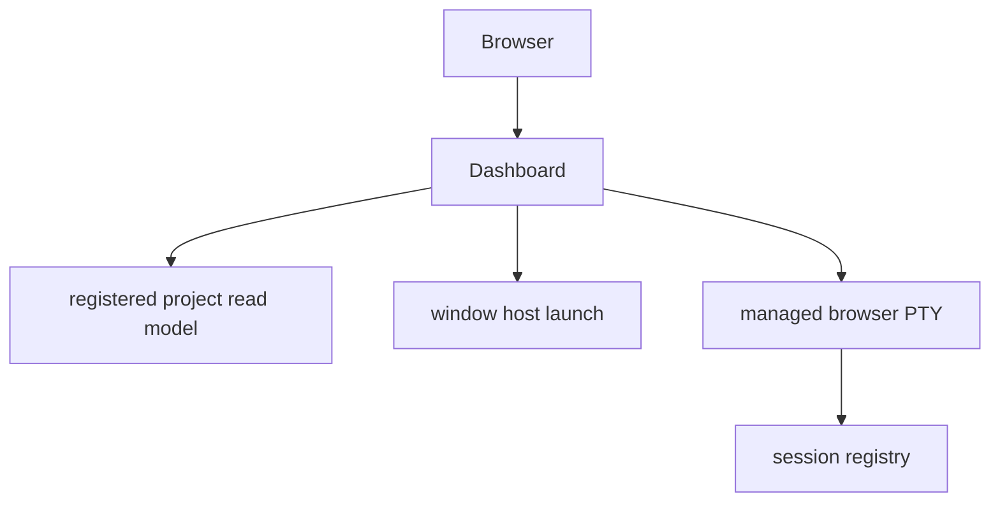

# Dashboard, Browser PTY, and Access Control

`dashboard.load_project()` is a fresh read model over registered project paths: Git state, PRD-first handoff fields, legacy compatibility content, backlog/execution/requirements, session state, and projection health. `gather_projects()` parallelizes independent loads while preserving configured order.

## Route and mutation boundary

Project routes use an index into configured projects rather than accepting arbitrary paths. Main GET surfaces include the project grid and fragments, sessions, skills/settings, GitHub catalog, static/PWA assets, `/health`, and PTY endpoints.

The dashboard is mostly read-only, with constrained launch actions:

- `target=app` starts a managed browser PTY;
- `target=window` calls shared terminal launch logic;
- `target=vscode` opens the project without registering an agent session.

Launch validates a known account alias, normalized posture, and configured-project index. Resume context is injected only for a selected project in resume mode.

This shows why browser PTY is an operator surface, not a separate execution model.

## Browser terminal behavior

`/pty/stream` is SSE over `pty_host` subscriptions. A viewer disconnect does not kill its hosted terminal. Viewer geometry is coordinated and invalid/dead terminal operations return HTTP 410 rather than silently targeting a replacement.

## Exposed mode

Default operation is loopback. `--exposed` requires valid Cloudflare Access configuration before binding and fails closed otherwise. Exposed requests require owner identity plus verified Access JWT except `/health`; same-origin rules are stricter for browser mutations. Local mode intentionally ignores an ambient access block so configuration cannot accidentally lock down loopback use.

`access_gate.authorized` is deliberately two-factor and deny-by-default: the expected owner header and a verified Cloudflare Access JWT must both pass. `verify_access_jwt` pins RS256, verifies the RSA signature selected from JWKS, and validates expiry, not-before, issuer, audience, and owner-email claims. `JWKSCache.get_key` caches keys by TTL and allows one bounded refetch when an unknown `kid` suggests key rotation. Do not accept `none`/HS256, omit claims, treat one factor as enough, or add unbounded key retries when extending this path.

Remote catalog rendering is cache-first: known cache entries render promptly and refresh in the background; untracked repository views read cache only.

**Focused tests:** `tests/test_dashboard.py`, `tests/test_dashboard_access.py`, and `tests/test_access_gate.py`. `AccessJwtVerifyTests` covers tampered tokens, `none`/HS256 algorithm rejection, claim failures, and unknown-key refetching; `AuthorizedTests` proves that owner header alone and JWT alone are both rejected. Also run `tests/test_backend.py` and `tests/test_pty_host.py` for launch/PTY behavior.

See [remote projects](../fleet/remote-projects.md) and [native entrypoints](native-entrypoints.md).
