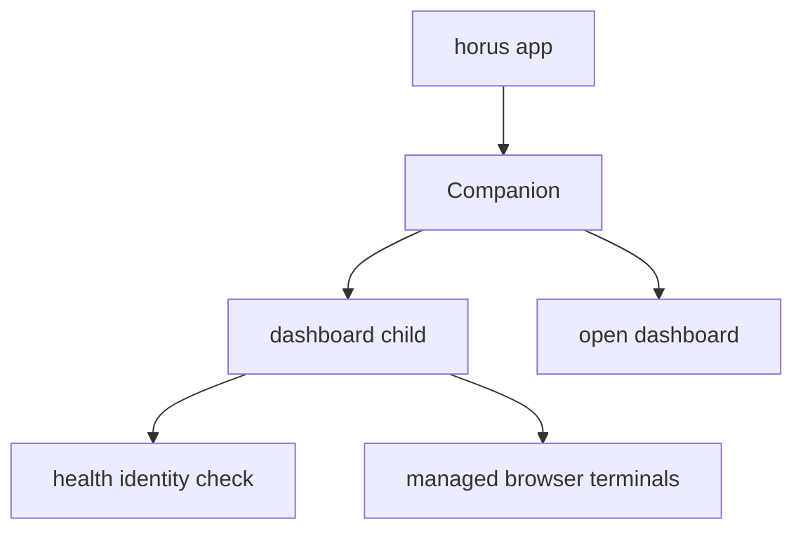

# Native Operator Entrypoints and Companion Lifecycle

Not all operator entrypoints are browser or TUI. `horus app` can own a native companion process; `vscode`, launcher/window functions, statusline, and input bridge provide platform-facing integrations around the shared session model.

## Companion ownership

`companion` manages a singleton companion and its dashboard child. It uses health identity checks to avoid confusing an unrelated server with its child, handles orphan conditions on Windows, and rotates startup logs with bounded retention. Startup/restart behavior must preserve this ownership and health boundary rather than assuming a port alone identifies Horus.

The companion owns the process relationship; dashboard PTY and terminal hosts own individual terminal/session behavior.

## Windows, terminal, and editor integration

`launcher` detects usable display/window mechanisms and applies platform fallbacks. `launch.prepare_interactive()` remains the source of adapter/account validation even when a native surface triggers it. `vscode` opens/focuses the editor project without creating a new agent session.

`statusline` accepts native-app signals and must fail quietly so malformed input never corrupts a terminal. `input_bridge` transports constrained owner interaction for `ask`/notification workflows; it is not a general remote command channel.

**Focused tests:** `tests/test_companion.py`, `tests/test_launcher.py`, `tests/test_launch.py`, `tests/test_vscode.py`, `tests/test_input_bridge.py`, `tests/test_statusline.py`.

For terminal lifecycle see [terminal hosts and TUI](terminal.md); for browser routes/PTY see [dashboard](dashboard.md).
