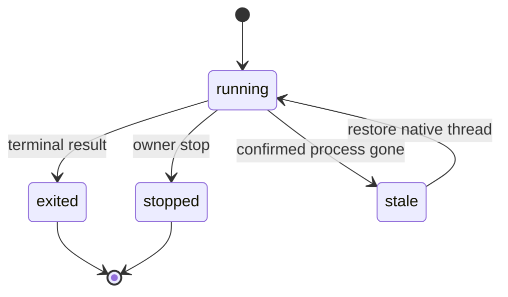

# Terminal Hosts, Sessions, and TUI

The terminal application has a Prompt Toolkit TUI for TTYs and a line-oriented fallback otherwise. Both select registered projects with `.horus/`, expose account-aware launches, and use the same host/session facade as the CLI.

## Host capabilities

`hosts` registers `current`, `tmux`, and `herdr`. Selection precedence is environment override, machine configuration, enclosing host, then automatic fallback. Callers must branch on `SessionHost.capabilities`, never literal host names.

| Capability | Meaning |
|---|---|
| persistent | Host owns lifecycle beyond the originating terminal |
| attach | A session can be reconnected |
| liveness | Host can safely confirm whether a target survives |
| viewer | Host can provide a terminal viewer |

`terminal_sessions.launch_on`, `attach_session`, and `stop_session` apply these capabilities. Unknown persisted hosts degrade to non-attachable instead of producing a broken action.

## Session lifecycle

`TerminalUI` separately materializes running and restorable records, projects/backlog/freshness, cached account usage, and remote catalog state. Network refresh is explicit: cache refresh and live usage/fleet refresh have separate actions.

A record is restorable only when it is stale because it vanished and has an agent-native thread ID. Restore preserves existing delivery fields and removes stale runner metadata before relaunch.

Reaping is intentionally conservative: it needs known host liveness, an unattached old target, a matching registry record, and terminal/dead-process confirmation. Unknown or foreign references are never reaped.

## Transcript discovery

`session_discovery` can find local Claude/Codex sessions attributable to a project by metadata such as cwd. It returns identifiers/timestamps/counts rather than transcript content, preserving a discovery-only boundary.

Dashboard browser terminals share the same session/host concepts; see [dashboard](dashboard.md). Companion/window/editor entrypoints are documented in [native operator entrypoints](native-entrypoints.md).

**Focused tests:** `tests/test_terminal_sessions.py`, `tests/test_terminal_tui.py`, `tests/test_hosts_herdr.py`, `tests/test_session_discovery.py`, `tests/test_pty_host.py`.
