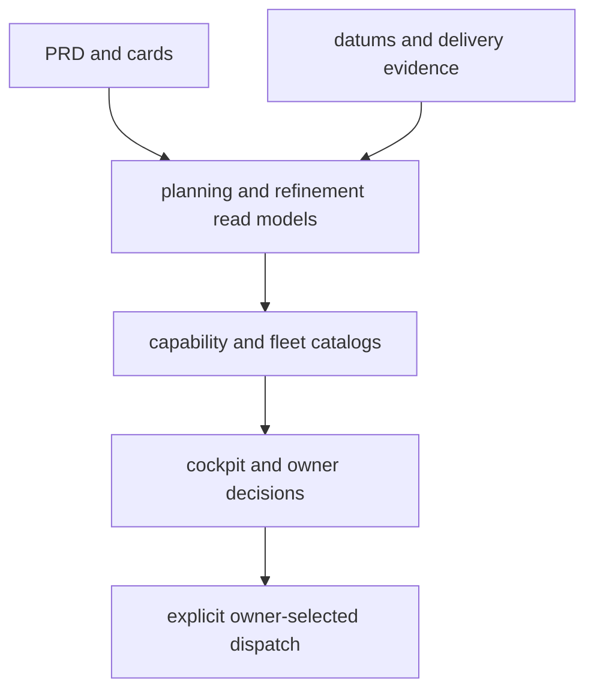

# Planning, Capability, and Fleet Intelligence

This subsystem is deliberately advisory. It converts evidence from continuity, cards, sessions, and Git into planning/read models, but it must never auto-select a model, account, card, or dispatch route.

## Facts, judgment, and normalization

`datums` stores machine-observed run facts: launch/completion, usage snapshots, runtime, delivery evidence, and mechanical exit classification. Owner-supplied qualitative outcome and model priors are separate data. This prevents a telemetry rollup from masquerading as an authorization or routing engine.

Tiers are vendor-neutral capability labels (`low`, `medium`, `high`, `frontier`). `normalize_tier` accepts legacy/model-oriented labels where evidence supports mapping, while migration/reporting preserves the distinction between old data and normalized capability points. Model names are canonicalized separately; a tier is not a total vendor/model ranking.

## Planning surfaces

- `brainstorm` builds a bounded planning prompt from project evidence.
- `backlog_refine` prepares current portfolio and delivery context for owner-attended card decisions.
- `backlog_tree` makes branch/facet structure and unresolved work visible.
- `skillmap` exposes installed workflow-skill coverage.
- `capabilities` generates provenance-stamped project/fleet catalogs through extensible extractors.
- `fleet_backlog` and `fleet_review` aggregate local project portfolios and review signals.

The final arrow is deliberately manual/explicit: planning output informs an owner, then separate [envelope authorization](../automation/unattended-dispatch.md) bounds any unattended run.

## Extension and validation

Capability extractors should expose provenance and degrade safely when their source is unavailable. Do not add a heuristic that silently routes work or interprets absent measurements as positive evidence. Keep new portfolio projections deterministic and read-only.

**Focused tests:** `tests/test_datums.py`, `tests/test_capabilities.py`, `tests/test_brainstorm.py`, `tests/test_backlog_refine.py`, `tests/test_backlog_tree.py`, `tests/test_fleet_backlog.py`, `tests/test_fleet_review.py`, `tests/test_skillmap.py`.

Cards are defined in [backlog](../continuity/backlog.md); execution produces the datum evidence in [agents and runs](../execution/agents-and-runs.md).
