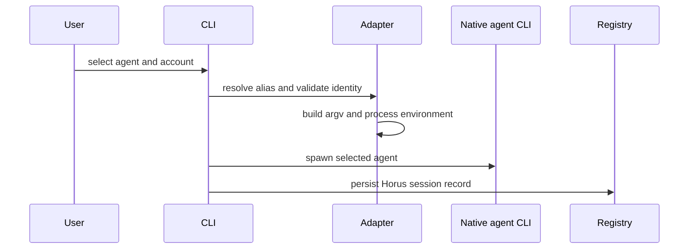

# Account Isolation, Adapters, and Launch Boundaries

## Accounts are selected per process

`~/.horus/accounts.toml`, owned by `config.py`, maps aliases to real identity labels and agent-specific state directories: Claude uses `CLAUDE_CONFIG_DIR`; Codex uses `CODEX_HOME`. An adapter builds the selected directory into the spawned process environment—Horus does not globally rewrite the caller’s environment.

`config.isolate_account()` creates machine-local isolation by selecting a source login and copying only the supported agent authentication/config files (`_ACCOUNT_AUTH_FILES`) into the agent-specific isolated directory, then mapping the alias to that directory. It refuses a source without a supported login and refuses to repurpose an identity already mapped to a different alias; it does not copy arbitrary agent state. `rename_account_alias()` propagates a renamed alias through both Claude config-directory and Codex-home mappings. `remove_account()` unmaps the alias and its configuration references but deliberately does **not** delete credential files from disk.

Before normal attended launch, Claude and Codex adapters verify the actual logged-in identity in the selected directory/home. First-login adoption is accepted only when that identity is not already aliased elsewhere. `cmd_run` resolves and provider-checks a named account before worktree or session creation, so a typo does not fall back to ambient credentials. Concurrent use of the same config/home produces an advisory collision warning, not a hard lock.

*Identity validation and environment construction happen before the native CLI starts.*

## IDs and adapter contract

Adapters share `SpawnSpec`, command/environment construction, spawn/resume behavior, and event parsing through `horus/adapters/base.py`. `get_adapter()` selects `claude`, `codex`, or the test-only `fake` adapter.

Do not equate the local `session_id` with `agent_session_id`:

- Fresh Claude can receive `--session-id`, so its provider thread commonly equals the Horus ID.
- Fresh Codex cannot receive a preassigned interactive thread. Horus initially records no native thread and later correlates a thread only when cwd/originator/time-window evidence is unambiguous.
- Restore uses an explicitly known native ID; Claude must not receive conflicting resume/session-id options.

`launch.prepare_interactive()` is the common preparation path: adapter lookup, posture validation, remote-control default, account validation, argv/environment, and tracking IDs. Direct terminal windows then use `launcher.open_terminal`; browser PTY launch separately mirrors adapter argv/environment and is regression-tested for parity.

## Backend and proxy boundaries

`backend.py` provides a small extension seam:

| Contract | Meaning |
|---|---|
| `LaunchBackend` | `launch`, `status`, `stream`, and `stop` operations over neutral handles. |
| `LaunchBrief` | Project, agent, account, posture, model, prompt, remote-control, and target request. |
| `Handle` | Opaque backend-labeled session reference; a backend rejects a handle owned by another backend. |
| `SessionStatus` / `StreamEvent` | Minimal cross-backend status/output vocabulary. |

`LocalBackend` is the only implementation. It permits local target work, maps launch results to registry-backed handles, reports `SessionStatus` from the local `Registry`, and stops via managed target or process termination as appropriate. It refuses unsupported stream behavior for attended local windows. Native Windows and non-local/remote targets raise `UnsupportedTarget`; they are not silently downgraded to local execution or another SDK. `remote_start` is similarly named but only clones/registers a GitHub repository **locally**; it does not provide remote execution.

A proxied launch is a deliberate authentication exception. `prepare_interactive(..., proxied=True)` bypasses local account-login verification only because proxy authentication belongs to the proxy token/endpoint boundary, not because the supplied account is trusted. Do not reuse that bypass for ordinary account launches.

## Validation

| Change surface | Focused tests |
|---|---|
| Account aliases and ambiguity | `tests/test_account_isolation.py`, `tests/test_account_resolution.py`, `tests/test_config.py` |
| Adapter argv/env/identity | `tests/test_adapters.py`, `tests/test_claude_adapter.py`, `tests/test_codex_adapter.py` |
| Session/native ID semantics | `tests/test_launch.py` |
| Backend no-fallback contract | `tests/test_backend.py` |
| Proxy boundary | `tests/test_proxy.py` |
| Browser launch parity | `tests/test_pty_host.py`, dashboard tests |

See [hosts and registry](hosts-and-registry.md) for process persistence and recovery, and [dispatch](../operations/dispatch-and-delivery.md) for worker launch authorization.
