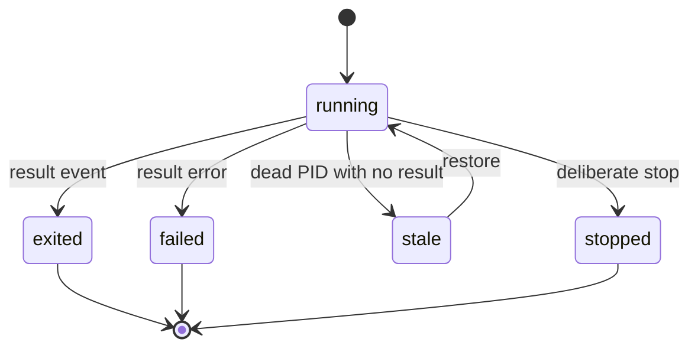

# Session Hosts, Registry, and Browser PTY Lifecycle

## Registry is local execution truth

`registry.Registry.default()` persists `SessionRecord` data in `~/.horus/registry.json`. Records include the Horus session ID, agent, project, account, PID, status/return code, host target/reference, native agent session ID, termination reason, and delivery/progress evidence. It is intentionally not Git-synced: PIDs and terminal references are machine-specific. Loading/upserting merges known updates with stored rows so unknown future fields survive: an older Horus installation does not erase newer registry metadata.



*Reconciliation prefers recorded result evidence; a dead PID alone is stale, not an invented worker outcome.*

`Registry.all()` reconciles before presenting rows. Structured JSONL result events win, legacy log results are a fallback, and dead PIDs without a result become `stale`. `snapshot()` computes a read-only projection. A hosted row can record `termination_reason="vanished"` when its host should have reported a clean exit; a direct window is not accused because normal quit and crash are indistinguishable. `display_status()` can render a legacy failed-plus-stopped record as stopped without rewriting stored data.

Only a stale record with a known provider-native thread is **restorable**. It is not live or attachable. Unknown native IDs pass through resume resolution to avoid blocking a legitimate agent session Horus did not track.

## Host capability layer

`horus.hosts` registers `tmux`, `herdr`, and `current`. Resolution precedence is `HORUS_TERMINAL_TARGET`, `[terminal] host`, then availability-driven auto selection (tmux, herdr, current). `terminal_sessions.py` is the caller-facing façade: it resolves a host, calls `ensure_ready()`, launches, and asks capabilities rather than hard-coding tmux behavior.

| Capability question | Why it matters |
|---|---|
| Persistent | Supports detached workers and continued process lifetime. |
| Attachable | A target reference can be reconnected to a terminal. |
| Viewer-capable | A browser PTY can show a persistent host session. |
| Liveness-capable | Orphan reaping can be proven rather than guessed. |
| State-capable | Host may expose meaningful agent/session state. |

`current` is a truthful floor: it offers no persistence, attach/viewer promise, or host liveness proof. Unknown host IDs from another installation degrade to “original terminal only.” `resolve_window_launch()` rejects a new OS window over SSH, without display, inside an existing host, or when user preference says otherwise.

## Browser PTY

`pty_host.host.start()` can launch directly into an in-process PTY or, for `managed=True`, launch on a viewer-capable resolved host and create a PTY for that host’s viewer command. It resolves once so the gated host, launch host, and viewer host cannot differ. If viewer creation fails, it rolls back the hosted session.

Dashboard SSE streams PTY frames; POST routes submit input, resize, redraw, release, or kill. Missing/dead terminals return HTTP 410 rather than accepting input silently. Viewer-identified resize is arbitrated as **smallest-wins** across connected viewers so a narrow phone cannot be overwritten by a wider observer; releasing a viewer removes its geometry contribution, and redraw replays buffered output without terminating the terminal. Hosted child processes receive `HORUS_HOSTED_SESSION`, `HORUS_PTY_HOST_PID`, and a compatible `TERM`; hooks use those markers to prevent a hosted session from killing/restarting its dashboard host.

## Worktree-isolated workers

`worktree.py` places a branch worktree beside, never inside, the primary checkout: `<repo-parent>/<repo-name>-wt-<branch-slug>`. It reuses a same-repository worktree but refuses an unrelated pre-existing destination. `cmd_run` reaches this only after account/model checks, envelope authorization, unattended defaults, and Codex delivery-posture validation.

Reclamation is conservative: survey is read-only; dirty or detached worktrees are preserved; removal requires an upstream-gone branch or proven ancestry in the fetched default branch; removal runs from the primary checkout rather than deleting the process cwd.

```sh
pytest -q tests/test_registry.py tests/test_terminal_sessions.py tests/test_pty_host.py
pytest -q tests/test_worktree.py tests/test_hosts_herdr.py
```
