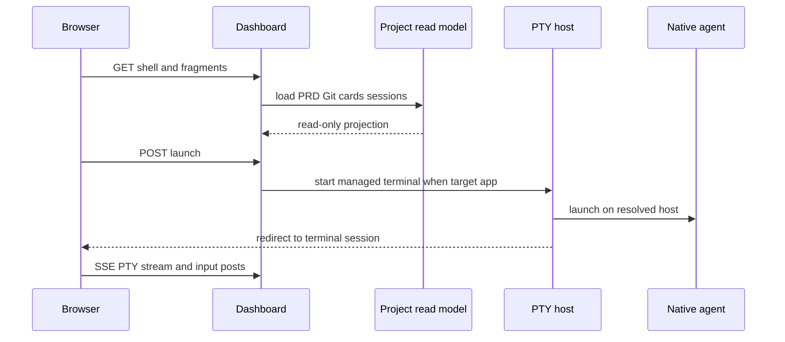

# Dashboard, Access Model, and Desktop Companion

`dashboard.py` serves a stdlib `ThreadingHTTPServer`. It is a read/control surface over local registered projects, machine-local sessions, and cached catalog data; it does not make GitHub or a browser the session authority.

## Read and launch paths

`GET /` renders a shell, then requests project/account/catalog fragments. `gather_projects()` concurrently calls `load_project()`, which reads PRD-first focus (`frontmatter.resolve_focus`), Git state, machine requirements, health, usage, upgrade dry-run, projection sync, cards, and registry/session data. Network-sensitive catalog refresh runs separately, so paint does not wait for GitHub.

*Dashboard launch validates a configured project/account, then a managed browser terminal views local native execution.*

`process_launch()` accepts a configured-project **index**, never a browser-supplied filesystem path; it validates account aliases and permission posture. Resume prompt injection occurs only for selected-project resume mode. `target=app` starts a managed PTY and redirects; `target=window` uses `backend.LocalBackend`; `target=vscode` opens a folder without creating an agent session. POST handlers use PRG redirects to make refresh safe.

The browser terminal routes use SSE output with POST input/resize/release/redraw/kill controls. `managed=True` resolves one viewer-capable persistent host for both launch and viewer; when no capable managed viewer path is available the PTY host uses its direct in-process PTY path. Failure after creating a managed host session but before viewer creation rolls that hosted session back. Viewer disconnect/release does not kill the managed session; stale terminals answer 410. Multi-viewer geometry uses viewer IDs and smallest-wins dimensions; release removes a viewer’s dimensions, while redraw replays buffered output rather than changing process lifetime.

## Access and write safety

Local mode is loopback-oriented and does not load `[access]` configuration. Exposed mode is explicit: incomplete/invalid access configuration fails before binding; every route except `/health` requires both configured owner identity and a verified Cloudflare Access **RS256** JWT. `access_gate` rejects other algorithms and validates JWKS key lookup/refresh and signature, then issuer, audience, email, expiry, and not-before claims. POST also requires same-origin: exposed mode rejects omitted Origin, local mode permits absent Origin for non-browser clients.

Further constraints:

- package/xterm asset paths reject traversal components;
- artifact-writing operations, including `/local-add` initialization/registration, refuse under a stale dashboard build;
- remote GitHub start/onboard routes limit owners to configured/trusted owners;
- dashboard launch remains local execution—there is no remote backend fallback.

## Companion

`companion.py` is a Tk desktop shell, not another web server. `run_companion()` takes an OS-owned localhost singleton lock, prewarms/ensures the dashboard, and shows worker status from the registry. `ensure_dashboard()` adopts a healthy current Horus dashboard, replaces an identified stale Horus build, and never kills an unidentified foreign listener. `stop_dashboard()` and owned browser cleanup only target children started by the companion. A dedicated browser profile supports app-window reuse without affecting the normal browser profile.

| Change area | Focused tests |
|---|---|
| Read model, routes, PTY, launch | `pytest -q tests/test_dashboard.py` |
| Exposure/JWT/origin behavior | `pytest -q tests/test_dashboard_access.py tests/test_access_gate.py` |
| Companion ownership/singleton | `pytest -q tests/test_companion.py` |

For session host/PTY mechanics see [hosts and registry](../sessions/hosts-and-registry.md); for catalog semantics see [catalog and onboarding](../operations/catalog-and-onboarding.md).
